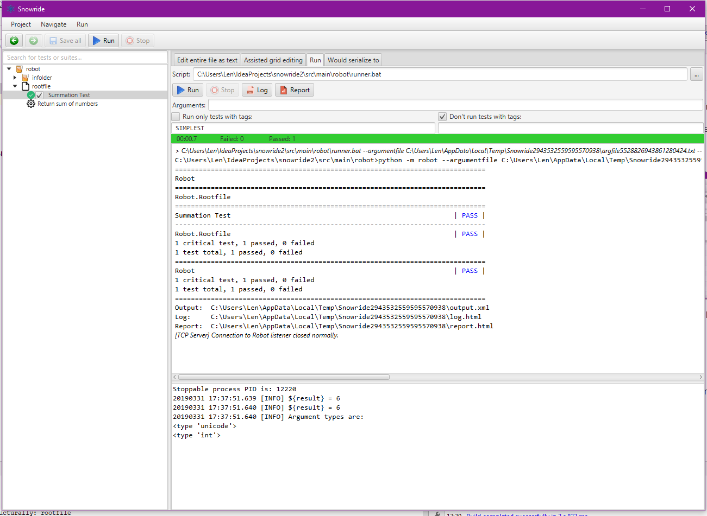

# Snowride
A faster RIDE-like IDE for Robot Framework test suites 

**Early Alpha.** Snowride is in early alpha. Many features aren't implemented yet.
Many other features are unstable. Use at own risk. I recommend [RIDE](https://github.com/robotframework/RIDE) as currently the best editor for Robot Framework.

**Screenshot.** 

**Download.**
Download Snowride from Bintray:
1. Go to https://bintray.com/soothsilver/snowride/snowride
2. In section "Downloads", download the "jar-with-dependencies".
3. Double-click it.

**Design principles of *Snowride*:**
* **Responsive.** Every operation should happen immediately. Snowride should load within a second. 
A test suite that contains thousands of tests should load within a second. Clicking any button or pressing any
key should have a result in the very next monitor frame. Snowride should never appear "frozen" or need to show
progress bars because an operation takes too long.
* **Efficient.** Stuff that you need to do often and repeatedly should be doable as quickly as possible, via keyboard
shortcuts, smart autocompletion, inspections, quick fixes, or good navigation.
* **Beautiful.** You should want to spend time in Snowride just because you will like looking at it.

**Planned advantages over other IDEs:** 
* Very fast 
* Doesn't freeze up
* Automated repeated testing
* Search Anything-style autocompletion
* Inspections
* Fast test runner
* Skeuomorphically pretty ^^
* Single file executable

**Test runner screenshot:**

